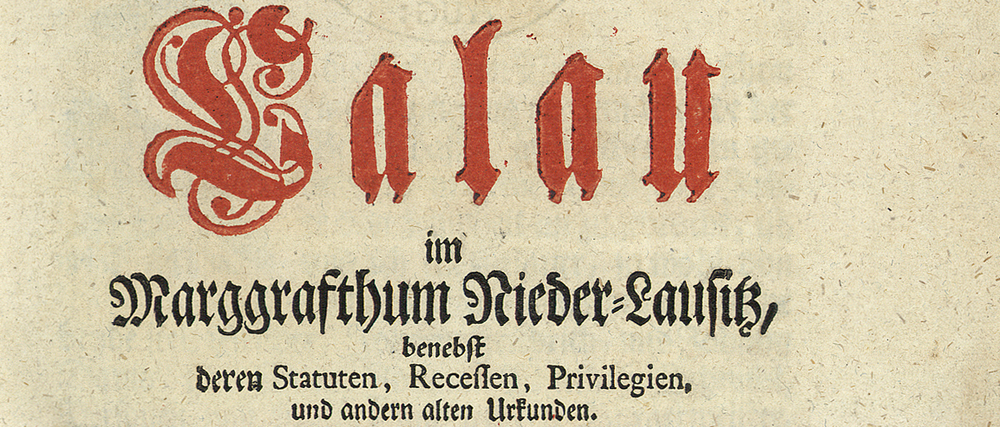

This is an **UNOFFICIAL** repo for the SauvolaNet (ICDAR2021).  

For the Original repo visit the following [URL](https://github.com/Leedeng/SauvolaNet.git)

# SauvolaNet: Learning Adaptive Sauvola Network


***

Documentation of [SauvolaNet-Training](https://mohamadmansourx.github.io/SauvolaNet-Training/) can be found on [https://mohamadmansourx.github.io/SauvolaNet-Training/](https://mohamadmansourx.github.io/SauvolaNet-Training/)

# Contents
- [Overview](#overview)
- [Dependency](#dependency)
- [Demo](#demo)
- [Training](#training)
- [Dataset](#dataset)


***
My Main Contribution are in the following:
#### TODO List
- [x] [Training](#training). Added training functions for both pretrained and from scratch model. 
- [x] [Configuration](docs/Training_Config.md) file to customize nearly everything in the pipeline.
- [x] Wandb API Support (Just add WandbCallback in the callbacks in Config file).
- [ ] Image Augmentations

***

# Overview

SauvolaNet is an end-to-end document binarization solution. It is optimal for three hyper-parameters of the classic Sauvola algorithm. Compare with existing solutions, SauvolaNet has followed advantages:

- **SauvolaNet do not have any Pre/Post-processing**
- **SauvolaNet has comparable performance with SoTA**
- **SauvolaNet has a super lightweight network structure and faster than DNN-based SoTA**


More precisely, SauvolaNet consists of three modules, namely, Multi-window Sauvola (MWS), Pixelwise Window Attention (PWA), and Adaptive Sauolva Threshold (AST).

- **MWS generates multiple windows of different size Sauvola with trainable parameters**
- **PWA generates pixelwise attention of window size**
- **AST generates pixelwise threshold by fusing the result of MWS and PWA.**


# Dependency

LineCounter is written in TensorFlow.
  
  - TensorFlow-GPU: 1.15.0
  - keras-gpu 2.2.4 
  
Other versions might also work but are not tested.


# Demo

Download the repo and create the virtual environment by following commands

```
conda create --name LineCounter --file spec-env.txt
conda activate Sauvola
pip install tensorflow-gpu==1.15.0
pip install opencv-python
pip install parse
```

Then play with the provided [notebook](https://github.com/mohamadmansourX/SauvolaNet-Training/blob/master/SauvolaNetDemo.ipynb).

Alternatively, one may play with the inference code using this [google colab link](https://colab.research.google.com/drive/1aGYXVRuTf1dhoKSsOCPcB4vKULtplFSA?usp=sharing).


# Training


Edit `Config.yaml` file and simply run the following to start training: 

(Check the following for more details on [Config parameters](docs/Training_Config.md))

```bash
$ python train.py
```

Can even edit some configurations directly from the command line.
The following list can be viewed through --help
```bash
$ python train.py -h

usage: train.py [-h] [-c CONF] [-a ARGS [ARGS ...]]

optional arguments:
  -h, --help            show this help message and exit
  -c CONF, --conf CONF  configuration file path
  -a ARGS [ARGS ...], --args ARGS [ARGS ...]
                        configuration arguments. e.g.: -a Train.loss=mse
```

# Dataset

For **each** image there should be an image for the original image e.g. `TRAIN_image1_source.jpg`, and an image for the ground truth image e.g. `TRAIN_image1_target.jpg`

The *pattern* to match source and groundtruth images is the name before the `'_source.*'` or `'_target.*'`
Besides, all the names should begin with `'TRAIN_'`

## Example:
| ImageID | Src Image: `TRAIN_<uniqueID>_source.<Extention>` | Target Image: `TRAIN_<uniqueID>_target.<Extention>` |
| ------------ | ------------ | ------- |
| P03 | `Dataset/TRAIN_P03_source.png`     | `Dataset/TRAIN_P03_source.png`     |
| |       |      |


## Available Datasets 
We do not own the copyright of the dataset used in this repo.

Below is a summary table of the datasets used in this work along with a link from which they can be downloaded:


| Dataset      | URL     |
| ------------ | ------- |
| DIBCO 2009   | http://users.iit.demokritos.gr/~bgat/DIBCO2009/benchmark/   |
| DIBCO 2010   | http://users.iit.demokritos.gr/~bgat/H-DIBCO2010/benchmark/ |
| DIBCO 2011   | http://utopia.duth.gr/~ipratika/DIBCO2011/benchmark/        |
| DIBCO 2012   | http://utopia.duth.gr/~ipratika/HDIBCO2012/benchmark/       |
| DIBCO 2013   | http://utopia.duth.gr/~ipratika/DIBCO2013/benchmark/        |
| DIBCO 2014   | http://users.iit.demokritos.gr/~bgat/HDIBCO2014/benchmark/  |
| DIBCO 2016   | http://vc.ee.duth.gr/h-dibco2016/benchmark/                 |
| DIBCO 2017   | https://vc.ee.duth.gr/dibco2017/                 |
| DIBCO 2018   | https://vc.ee.duth.gr/h-dibco2018/                 |
| PHIDB | http://www.iapr-tc11.org/mediawiki/index.php/Persian_Heritage_Image_Binarization_Dataset_(PHIBD_2012) |
| Bickely-diary dataset | https://www.comp.nus.edu.sg/~brown/BinarizationShop/dataset.htm |
| Synchromedia Multispectral dataset | http://tc11.cvc.uab.es/datasets/SMADI_1　|
| Monk Cuper Set | https://www.ai.rug.nl/~sheng/ |
